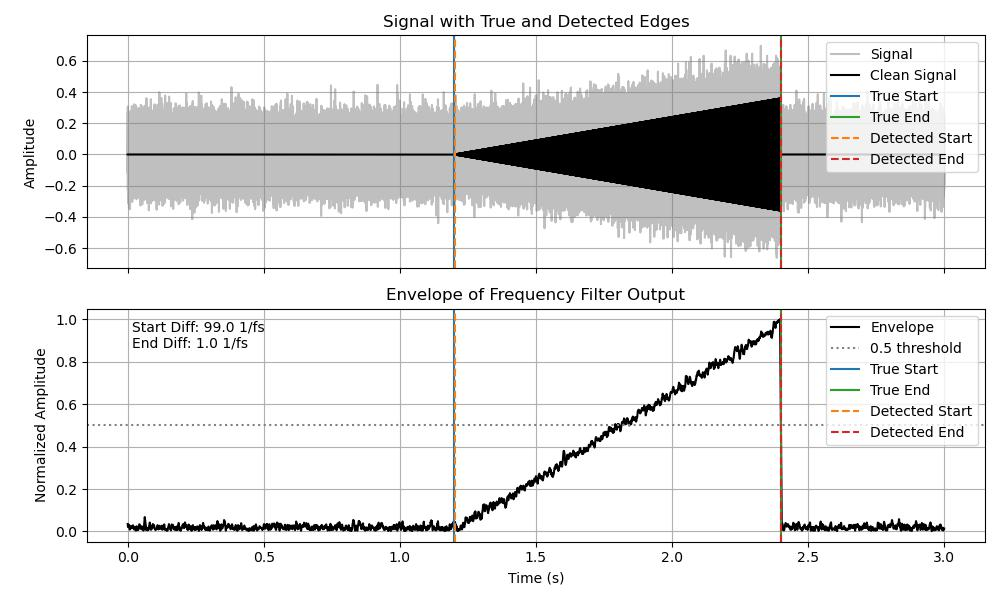

# Signal Onset and End Detection in Noisy Data

This project implements and benchmarks various algorithms to detect the **start** and **end** of time-localized signals (boxcar, ramp up/down) that are **buried in noise**. The core idea is to use prior knowledge of signal shape or frequency content to detect its temporal boundaries reliably.

---

## 🔍 Example Output



**Top plot:** Original signal (gray), clean version (black), ground truth vs detected boundaries  
**Bottom plot:** Frequency-domain envelope used for detection with threshold and annotation

---

## 🎯 Key Features

- 📦 **Boxcar**, **ramp-up**, and **ramp-down** signal models
- 🧠 Envelope extraction via **frequency filtering and correlation**
- 🎯 Start and end detection using a **crossing threshold**
- 📊 Annotated plots for easy comparison of ground truth vs detected boundaries
- 📁 Modular design: notebooks + reusable Python modules

---

## ⚙️ Signal Types

| Type        | Description                             |
|-------------|-----------------------------------------|
| Boxcar      | Flat amplitude within a time window     |
| Ramp-Up     | Linearly increasing envelope            |
| Ramp-Down   | Linearly decreasing envelope            |

Signals are modulated with a sine carrier and buried in additive Gaussian noise.

---

## Structure

- `src/`: Signal detection algorithms
- `notebooks/`: Demonstration notebooks
- `tests/`: Unit tests
- `data/`: Synthetic/real signals
- `results/`: Output plots and figures

## 🚀 How to Use

1. Clone the repo:

```bash
git clone https://github.com/niththomas/signal-onset-end-detection.git
cd signal-onset-end-detection
contains various algorithms to detect the start and end of signals buried in noise.
